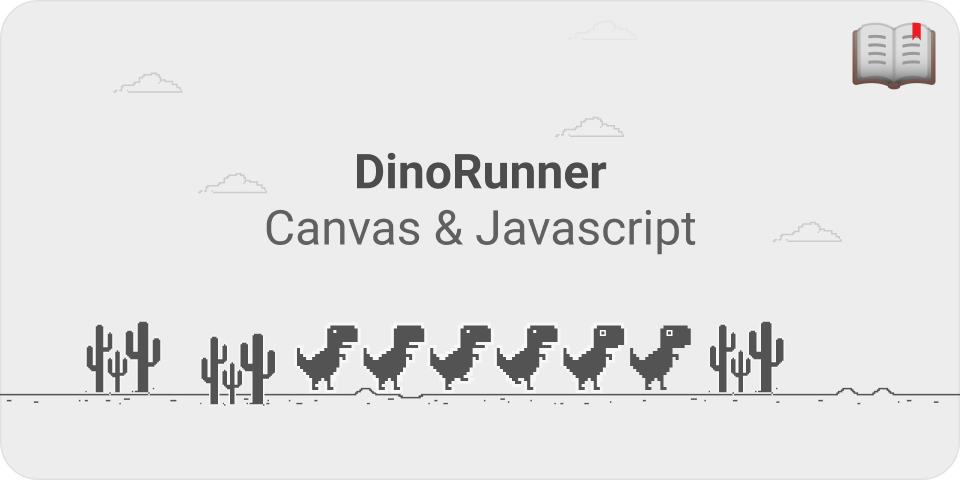

# HTML Canvas & JavaScript

Let's create a simple game using **Canvas** and JavaScript, it will be the perfect opportunity to learn how to use **Canvas** and a bit of modern JavaScript too!

**CANVAS** is an HTML element which can be used to draw graphics via scripting (usually JavaScript). This can, for instance, be used to draw graphs, combine photos, or create simple (and not so simple) animations.

---

## The basics.

At first sight a **canvas** looks like the html **img** element, with the only clear difference being that it doesn't have the **src** and **alt** attributes.

> When no width and height attributes are specified, the canvas will initially be 300 pixels wide and 150 pixels high.

The **canvas** element creates a fixed-size drawing surface that exposes one or more rendering contexts, which are used to create and manipulate the content shown. In this workshop, we focus on the 2D rendering context.

There is a method called **getContext()**, used to obtain the rendering context and its drawing functions. **getContext()** takes one parameter, the type of context. you specify "2d" to get a **CanvasRenderingContext2D.**

    let canvas = document.getElementById('workshop');
    let ctx = canvas.getContext('2d'); // Context

### Drawing Text.

The canvas rendering context provides two methods to render text:

**fillText( *text, x, y [, maxWidth]* )**

*Fills a given text at the given (x,y) position. Optionally with a maximum width to draw.*

**strokeText( *text, x, y [, maxWidth]* )**

*Strokes a given text at the given (x,y) position. Optionally with a maximum width to draw.*

    function draw() {
      let ctx = document.getElementById('workshop').getContext('2d');
      ctx.font = '48px serif';
      ctx.fillText('Wot wot wooot!', 10, 50);
    }

### Drawing Images.

**drawImage( *image, x, y* )**

Draws the `CanvasImageSource` specified by the `image` parameter at the coordinates (`x`, `y`).

You can also call **drawImage()** and send not only the position, but also the size.

    function draw() {
      let ctx = document.getElementById('workshop').getContext('2d');
    	let img = new Image();
    	img.src = "Insert a url pointing to an image.";
    	ctx.drawImage(img, 20, 180, 550, 200);
    }

### Basic Animations!.

You need to take a few steps to be able to animate stuff inside a **Canvas**, animate your text and image and you are done!

1. **Clear the canvas** Unless the shapes you'll be drawing fill the complete canvas (for instance a backdrop image), you need to clear any shapes that have been drawn previously. The easiest way to do this is using the **clearRect( *x, y, width, height* )** method.
2. **Save the canvas state** If you're changing any setting (such as styles, transformations, etc.) which affect the canvas state and you want to make sure the original state is used each time a frame is drawn, you need to save that original state.
3. **Draw animated shapes** The step where you do the actual frame rendering.
4. **Restore the canvas state** If you've saved the state, restore it before drawing a new frame.

---

## Stuff made with canvas.

- [http://andrew.wang-hoyer.com/experiments/cloth/](http://andrew.wang-hoyer.com/experiments/cloth/)
- [https://lab.hakim.se/blob/03/](https://lab.hakim.se/blob/03/)
- [https://lab.hakim.se/magnetic/02/](https://lab.hakim.se/magnetic/02/)
- [https://lab.hakim.se/trail/03/](https://lab.hakim.se/trail/03/)